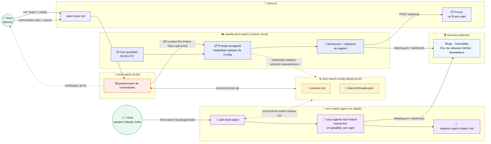

# tech-watch-agent

*[English](README.md)*

Une veille technologique automatisée et à la demande : une routine cloud quotidienne et une skill Claude Code interactive font des recherches sur une liste configurable de sujets, rédigent des rapports structurés et les livrent sur Discord — avec une ligne de commande native Discord pour piloter l'ensemble.

> **Entièrement conçu par de l'IA agentique.** Chaque partie de ce projet — le pipeline de recherche, le câblage de la routine cloud, le bot Discord et ses commandes, le débogage des incidents, ainsi que ce README (anglais et français) — a été conçu, écrit et exploité par Claude (l'assistant de codage agentique d'Anthropic), travaillant de façon autonome et en interaction avec le porteur du projet. Aucun code ni aucune documentation ici n'a été écrit à la main par un humain.

## Table des matières

- [Vue d'ensemble](#vue-densemble)
- [Dépôts](#dépôts)
- [Architecture](#architecture)
- [Déroulement d'une exécution](#déroulement-dune-exécution)
- [Lancer une veille](#lancer-une-veille)
  - [À la demande : la skill `/tech-watch`](#à-la-demande--la-skill-tech-watch)
  - [Automatique : la routine cloud `weekly-tech-watch`](#automatique--la-routine-cloud-weekly-tech-watch)
  - [À la demande depuis Discord : la commande `run`](#à-la-demande-depuis-discord--la-commande-run)
- [Interface Discord](#interface-discord)
- [Référence des commandes](#référence-des-commandes)
- [Configuration et flux de données](#configuration-et-flux-de-données)
- [Limitations connues et notes opérationnelles](#limitations-connues-et-notes-opérationnelles)
- [Installation](#installation)
- [Feuille de route](#feuille-de-route)

## Vue d'ensemble

Douze sujets (ou le nombre actuellement configuré) — `dbt`, `Apache Airflow`, `Cybersecurity`, `Linux`, etc. — disposent chacun d'une liste de sources sélectionnées (blogs, subreddits, flux de releases GitHub, newsletters). Une exécution fait des recherches sur chaque sujet pour une fenêtre temporelle donnée, filtre les résultats selon un seuil de qualité, rédige un rapport Markdown par sujet, puis le livre soit directement dans le chat (à la demande), soit dans un fil Discord persistant (automatisé).

Il y a trois composants mobiles, répartis dans trois dépôts, plus une routine cloud Claude Code :

## Dépôts

| Dépôt | Visibilité | Rôle |
| --- | --- | --- |
| **[tech-watch-agent](https://github.com/thoutmose/tech-watch-agent)** (ce dépôt) | Public | La skill à la demande, le sous-agent de recherche, et les rapports commités. |
| **[tech-watch-config](https://github.com/thoutmose/tech-watch-config)** | Privé | Source de vérité pour la liste des sujets, les sources, et la correspondance sujet → fil Discord (`sources.md`, `discord-threads.json`). |
| **[tech-watch-cli-bot](https://github.com/thoutmose/tech-watch-cli-bot)** | — | Un bot Discord qui transforme un salon `#cli` en ligne de commande pour éditer `tech-watch-config` et déclencher des exécutions à la demande. |
| **`weekly-tech-watch`** | — | Pas un dépôt — une [routine cloud Claude Code](https://code.claude.com/docs/en/routines) (claude.ai/code/routines) qui exécute le pipeline automatisé quotidien et publie sur Discord. |

## Architecture

Les deux chemins font le même travail de recherche sur les mêmes sources externes (blogs, subreddits, flux de releases GitHub, newsletters) — l'asymétrie clé du schéma porte sur la configuration, pas la recherche : la skill à la demande et le bot parlent tous les deux à `tech-watch-config` **en direct**, mais le prompt enregistré de la routine cloud ne contient qu'un **instantané statique** de ce dépôt — voir [Configuration et flux de données](#configuration-et-flux-de-données).

## Déroulement d'une exécution

Pour chaque sujet dans le périmètre, une exécution :

1. Vérifie chaque source listée pour des éléments publiés dans la fenêtre temporelle (WebSearch/WebFetch).
2. Lance des recherches plus larges pour rattraper ce que les sources listées auraient manqué, et repérer de nouvelles sources à ajouter durablement.
3. Filtre selon un seuil de qualité : sources primaires plutôt que reprises d'agrégateurs ; un vrai signal de citation/discussion (points HN/Reddit, étoiles GitHub, citations arXiv, corroboration indépendante) ; une date de publication confirmée dans la fenêtre ; pas de teaser payant invérifiable ; dédoublonné.
4. Rédige `reports/<slug-du-sujet>/<AAAA-MM-JJ>.md` : un titre, un résumé de 3 à 6 phrases synthétisant les thèmes de la période, une section de résultats (titre, source, date, lien, pourquoi c'est important, résumé — par élément), et une liste des sources consultées avec les nouvelles sources marquées `(NEW)`.
5. Si rien ne franchit le seuil, le rapport le dit clairement plutôt que d'être rempli artificiellement ou d'omettre le sujet.

## Lancer une veille

### À la demande : la skill `/tech-watch`

À exécuter dans une session Claude Code :

| Invocation | Effet |
| --- | --- |
| `/tech-watch` | Tous les sujets de `sources.md`, semaine écoulée |
| `/tech-watch "LLM agents"` | Seulement le sujet correspondant à « LLM agents » (correspondance de sous-chaîne) |
| `/tech-watch this month` / `last week` / `last year` | Change la période |
| `/tech-watch "LLM agents" last month` | Combine sujet + période |

Un sous-agent `tech-watch-researcher` (actuellement **Sonnet**) tourne par sujet, en parallèle. Les résultats sont compilés et présentés directement dans le chat, et `sources.md` est mis à jour avec les nouvelles sources découvertes. **Ce chemin ne publie pas sur Discord** — voir les deux sections suivantes pour cela.

### Automatique : la routine cloud `weekly-tech-watch`

Tourne seule, chaque jour, sans intervention :

- **Planification** : `0 5 * * *` (05:00 UTC — 07:00 heure de Paris en été). La planification n'a pas de champ fuseau horaire, donc elle dérive d'une heure lors des changements d'heure d'été/hiver.
- **Fenêtre** : le jour précédent glissant (alignée sur la cadence quotidienne — une fenêtre plus longue republierait les mêmes actualités chaque jour).
- **Livraison** : publie le rapport de chaque sujet — ou une courte note « rien de neuf aujourd'hui » si la fenêtre était calme — dans le fil Discord de ce sujet via un webhook, en découpant en plusieurs messages si un rapport dépasse la limite de 2000 caractères de Discord.
- **Changements de modèle / planification** : modifiables de façon fiable uniquement depuis l'éditeur web de la routine sur [claude.ai/code/routines](https://claude.ai/code/routines) — voir [Limitations connues](#limitations-connues-et-notes-opérationnelles).

### À la demande depuis Discord : la commande `run`

Taper `run "<Sujet>"` dans `#cli` déclenche *la même* routine immédiatement, via l'[API routine-fire](https://platform.claude.com/docs/en/api/claude-code/routines-fire) d'Anthropic, plutôt que d'attendre la planification quotidienne. Le ciblage par sujet fonctionne grâce à une petite convention explicite : le champ optionnel `text` de la requête de déclenchement porte un indice `Topic: <nom>`, qui arrive enveloppé dans un bloc `<routine-fire-payload>` non fiable (l'API d'Anthropic ne laisse jamais une entrée fournie au déclenchement agir comme une instruction à elle seule) ; le prompt enregistré de la routine lit explicitement cet indice comme une *donnée* et se restreint au sujet nommé. `run all` (ou `run` seul) omet l'indice et traite tout, comme l'exécution quotidienne.

## Interface Discord

Un salon Forum, un fil persistant par sujet, créé automatiquement lors de la première publication d'un sujet et réutilisé à chaque fois ensuite (la correspondance vit dans `discord-threads.json` de `tech-watch-config`). Un salon textuel séparé `#cli` sert de ligne de commande au bot — voir ci-dessous.

## Référence des commandes

Toutes ces commandes se tapent dans le salon Discord `#cli` et sont traitées par `tech-watch-cli-bot` (voir [ce dépôt](https://github.com/thoutmose/tech-watch-cli-bot) pour le code source et les instructions d'installation complètes) :

| Commande | Effet |
| --- | --- |
| `topic add "<Nom>"` | Ajoute un nouveau sujet |
| `topic rm "<Nom>"` | Supprime un sujet et ses sources |
| `topic list` | Liste tous les sujets |
| `source add "<Sujet>" <url>` | Ajoute une source à un sujet |
| `source rm "<Sujet>" <url-ou-index>` | Supprime une source (par URL/texte ou par son numéro dans `source list`) |
| `source list "<Sujet>"` | Liste les sources d'un sujet |
| `run "<Sujet>"` | Déclenche une exécution à la demande limitée à un sujet |
| `run all` | Déclenche une exécution à la demande pour tous les sujets |
| `run "<Sujet>" --notify` / `run all --notify` | Pareil, avec une notification dans `#cli` une fois la publication effective (ou en cas de délai dépassé) |
| `help` | Affiche cette liste |

Les noms de sujets sont comparés sans tenir compte de la casse ; les sous-chaînes non ambiguës fonctionnent (`topic rm "airflow"` correspond à « Apache Airflow »). Mettez entre guillemets les noms contenant des espaces.

Il n'y a volontairement **pas de commande `schedule`** — voir [Limitations connues](#limitations-connues-et-notes-opérationnelles) pour la raison.

## Configuration et flux de données

`tech-watch-config` (privé) est la source de vérité pour les sujets, les sources et les identifiants de fils Discord. Deux des trois consommateurs restent synchronisés en direct avec ce dépôt :

- La **skill à la demande** se synchronise avec lui avant chaque exécution.
- Le **bot `#cli`** le lit et l'écrit directement, à chaque commande, via git.

**La routine cloud quotidienne fait exception.** Elle ne clone pas et ne lit pas `tech-watch-config` en direct au moment de l'exécution — son prompt enregistré contient un *instantané statique* de `sources.md` et `discord-threads.json`, écrit la dernière fois qu'une personne (un mainteneur, via les réglages de la routine ou l'outillage interne de Claude Code) l'a rafraîchi. Un sujet ou une source ajoutée via le bot apparaît immédiatement dans `tech-watch-config` et dans la prochaine exécution de la skill à la demande, mais **pas** dans la routine quotidienne tant que cet instantané n'a pas été rafraîchi manuellement. C'est une limite connue, pas un choix de conception — voir la feuille de route.

## Limitations connues et notes opérationnelles

Ces points ont coûté un vrai temps de débogage à découvrir ; ils sont notés ici pour ne pas avoir à les redécouvrir :

- **Accès réseau.** L'environnement cloud de la routine doit autoriser `discord.com` — soit un accès réseau **Full** (complet), soit **Custom** (personnalisé) avec `discord.com` dans la liste d'autorisation. Le niveau **Trusted** (par défaut) ne l'inclut *pas* (il ne couvre que les registres de paquets, GitHub, les API des fournisseurs cloud, et similaires). En **Trusted**, chaque POST vers le webhook échoue silencieusement au niveau du proxy avec `CONNECT tunnel failed, 403` — l'exécution se termine par ailleurs normalement (les rapports sont écrits, les commits git ont lieu), donc rien ne *semble* cassé à part un fil Discord vide. Modifiable uniquement depuis les réglages de l'environnement sur [claude.ai/code](https://claude.ai/code) (pas d'API pour cela non plus).
- **Pas d'API publique pour changer la planification ou le modèle.** L'[API routine-fire](https://platform.claude.com/docs/en/api/claude-code/routines-fire) d'Anthropic peut seulement *démarrer une exécution* du prompt déjà enregistré de la routine — elle ne peut ni lire ni réécrire ce prompt, la planification cron, ou le modèle, depuis l'extérieur de claude.ai. C'est délibéré (un jeton propre à une routine qui pourrait réécrire sa propre configuration serait bien plus dangereux en cas de fuite). Ces changements nécessitent l'interface web ou une session Claude Code interactive authentifiée.
- **Ne jamais laisser la routine supprimer des messages Discord.** Son prompt interdit explicitement toute requête `DELETE` contre Discord, ajouté après un incident où le message initial/titre d'un fil a disparu suite à deux exécutions à la demande. Le fil a continué de fonctionner normalement sans lui (Discord n'exige pas de message initial pour accepter de nouveaux messages), mais c'est un bon rappel qu'un agent autonome disposant d'identifiants de webhook doit recevoir l'instruction explicite de ne jamais rien supprimer.
- **Utiliser `curl`, pas le client HTTP d'un langage de script, pour les publications webhook.** La façade de Discord (Cloudflare) a été observée en train d'identifier et de bloquer les clients non-navigateurs (par ex. `urllib` de Python) avec un 403, même contre un webhook parfaitement valide.

## Installation

- **Ce dépôt** : rien à installer — ce sont des données (`reports/`, `sources.md` ignoré par git) plus les définitions de skill/agent sous `.claude/`.
- **`tech-watch-cli-bot`** : l'installation complète (création du bot Discord, jeton GitHub, jeton routine-fire) est documentée dans le [README de ce dépôt](https://github.com/thoutmose/tech-watch-cli-bot#one-time-setup).
- **La routine `weekly-tech-watch`** : créée et configurée sur [claude.ai/code/routines](https://claude.ai/code/routines) ; son prompt, sa planification et son environnement sont gérés là-bas (voir les limitations ci-dessus pour ce qui peut ou non être fait depuis l'extérieur de cette interface).

## Feuille de route

- [x] Livraison automatisée quotidienne sur Discord
- [x] Déclenchement d'exécutions à la demande depuis Discord (commande `run`, avec ciblage par sujet et `--notify`)
- [ ] Synchronisation automatique de l'instantané de configuration intégré à la routine avec `tech-watch-config` (actuellement une étape manuelle)
- [ ] Un moyen fiable, piloté par API, de changer la planification/le modèle de la routine sans passer par l'interface web
